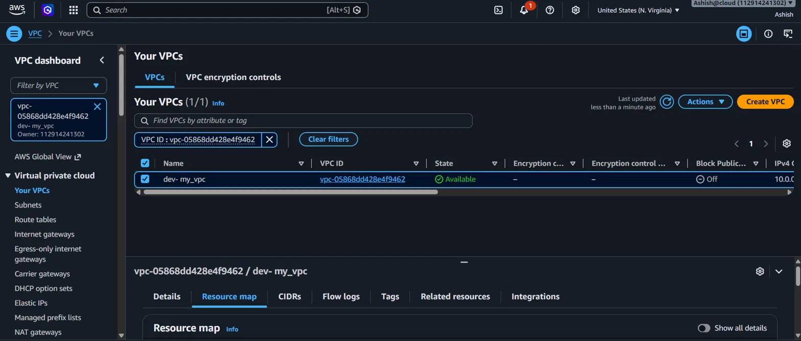
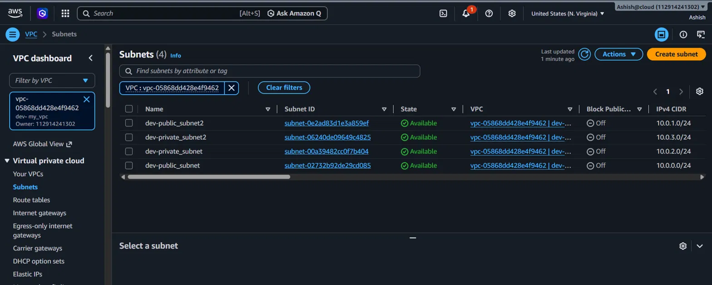
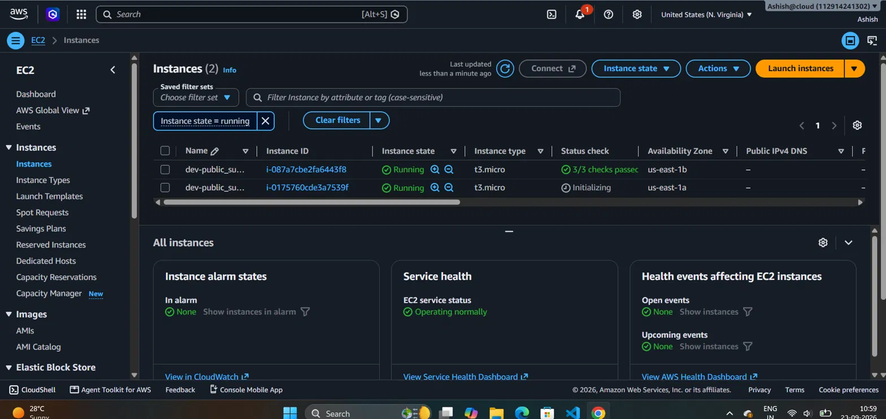
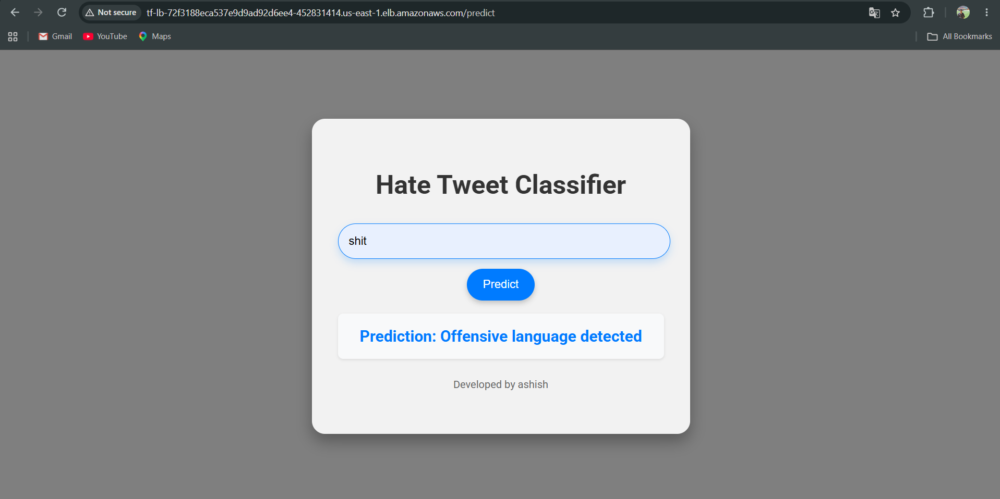

# aws-ha-web-app

A highly available AWS web application infrastructure, built end-to-end with Terraform. Deploys a Flask-based ML app (hate speech classifier) across two Availability Zones, behind an Application Load Balancer, with EC2 instances isolated in private subnets and outbound internet access through a NAT Gateway.

## Architecture


**Flow:** Internet → Internet Gateway → Application Load Balancer (public subnets) → EC2 instances (private subnets, port 5000). Outbound traffic from EC2 (package installs, git clone) goes through the NAT Gateway → Internet Gateway.

- **VPC** — `10.0.0.0/16`, spanning 2 Availability Zones
- **Public subnets** (2, one per AZ) — host the ALB and the NAT Gateway
- **Private subnets** (2, one per AZ) — host the EC2 instances running the app
- **Internet Gateway** — gives the public subnets internet access
- **NAT Gateway** — gives the private subnets outbound-only internet access
- **Application Load Balancer** — internet-facing, listens on port 80, forwards to EC2 targets on port 5000
- **Security groups** — EC2 security group only accepts inbound traffic on port 5000 from the ALB's security group (no direct internet access to the app tier)
- **Automation** — EC2 instances install dependencies and start the app automatically via a `user_data` script (no manual SSH needed)

## Tech Stack

- **IaC:** Terraform (modular — `vpc`, `ec2`, `alb`)
- **Cloud:** AWS (VPC, EC2, ALB, NAT Gateway, Security Groups)
- **App:** Python, Flask, scikit-learn (served with Gunicorn)

## Project Structure

```
hatespeech/
├── vpc/          # VPC, subnets, route tables, IGW, NAT Gateway
├── ec2/          # EC2 instances, key pair, security group
├── alb/          # Application Load Balancer, target group, listener
├── main.tf       # Root module wiring vpc, ec2, alb together
├── deploy.sh     # user_data script — installs deps and starts the app
└── screenshot/   # Architecture diagram and console screenshots
```

## Setup

```bash
git clone https://github.com/aashish951/aws-ha-web-app.git
cd aws-ha-web-app/hatespeech

terraform init
terraform plan
terraform apply
```

Once applied, grab the ALB's DNS name from the AWS Console (EC2 → Load Balancers) and open it in a browser.

To tear everything down and avoid ongoing charges (the NAT Gateway is billed hourly):

```bash
terraform destroy
```

## Screenshots

**VPC Resource Map**


**Subnets (public + private, across 2 AZs)**


**Route Tables**


**Internet Gateway**


**NAT Gateway**


**Elastic IP (attached to NAT Gateway)**


**EC2 Instances (running in private subnets)**


**Load Balancer**


**Target Group — Healthy Targets**


**App Running via ALB**


## Key Design Decisions

- **Private subnets for the app tier** — EC2 instances have no public IP; only the ALB is internet-facing.
- **Security group chaining** — the app's security group allows inbound traffic on port 5000 only from the ALB's security group, not from `0.0.0.0/0`.
- **Multi-AZ** — both the ALB and the EC2 instances are spread across two Availability Zones for high availability.
- **Fully automated deployment** — no manual SSH or scripting required after `terraform apply`; the app is live once the target group reports healthy.

---
Built by [Ashish](https://github.com/aashish951)
